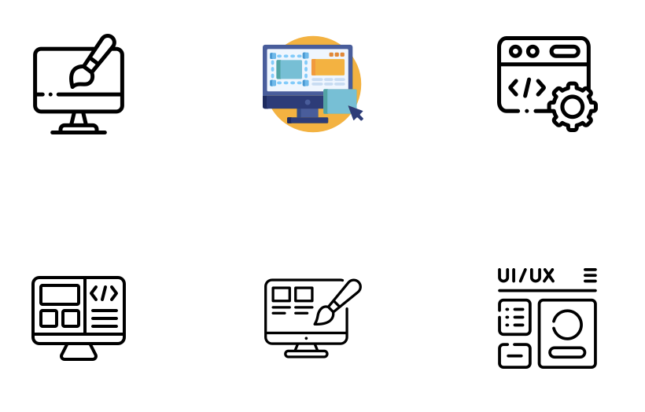
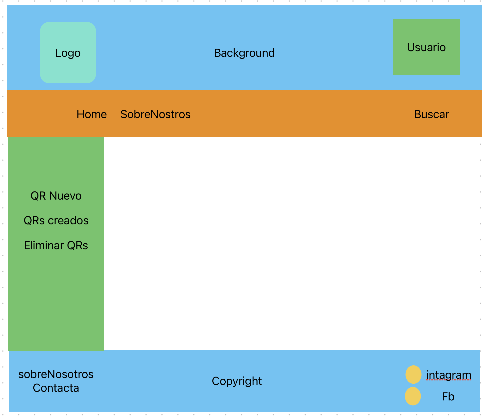

# Documentació de projecte

## Apartats de la documentació

0. Promoció

   - Nom de l'aplicació
   - Descripció en una frase
   - Quí som
   - Video promocional
1. Planificació

   - Necessitat de l'aplicació
   - Altres solucions existents
   - Principals funcionalitats
   - Guia d'estil https://design.theguardian.com/, https://design.duolingo.com/, https://resources.specialolympics.org/marketing-and-communications/special-olympics-brand
     - Logo
     - Colors
     - Tipografies
     - Icones
     - Layout  (Figma, mockflow...)
2. Desenvolupament

   - Tecnologies emprades
   - Base de dades
   - E/R
   - SQL
   - Proves de programari
   - Estructura del programari
   - UML
   - Casos d'ús
   - Estructura del client
   - Estructura del servidor. (API Documentation)
   - Documentació Scrum (Backlog)
   - Instal·lació de servidors, llibreries...
   - Descripció del procés de desenvolupament
     - Product Roadmap
3. Manual d'usuari

   - Manual d'usuari complet
   - How To Guides
   - Quick Start
   - Troubleshooting Guides
   - FAQs
   - Comunity Docs
4. Problemes resolts
5. Monetització
6. Propostes de millora
7. Bibliografia
8. Annexos
9. Promoció

* Nom de l'aplicació:
  * QRra.
* Descripció en una frase:
  * **QRra**: Aquest projecte tractarà sobre la de creació d’un lloc web on els usuaris podran generar codis QR d’adreces URL. A més a més, disposaran de l’opció de registrar-se i crear carpetes per emmagatzemar i gestionar els diferents codis QRs.
    Així podem concloure, que QRra necessitarà l’aplicació de tecnologies de front-end i back-end pel seu desenvolupament, utilitzant els seus llenguatges corresponents (php, html, css, etc.) i la creació d’una base de dades per guardar la informació necessària dels usuaris.
* Quí som
  * Som un grup de estudiants i estem fent un projecte

2. Planificació

* Necessitat de l'aplicació
  * User Persona (Buscar en Canva plantilles)
* Altres solucions existents
  * Hi ha moltes pagines que fan lo mateix. Algunes:
    * https://es.qr-code-generator.com/
    * https://www.the-qrcode-generator.com/
* Principals funcionalitats
  * Generar codis QR d’adreces URL y guardarlos.
* Guia d'estil https://design.theguardian.com/, https://design.duolingo.com/, https://resources.specialolympics.org/marketing-and-communications/special-olympics-brand
  * Logo
   >   
  * Colors
  > 
  * Tipografies
    * Nunito
  * Icones
  >  
  * Layout (Figma, mockflow...)
  > 

1. Desenvolupament
   - Tecnologies emprades
     * HTML, CSS, JS, PHP, SQL
   - Base de dades
     * Relacional
   - E/R
     * En process
   - SQL
     - MySQL
   - Proves de programari
   - Estructura del programari
   - UML
   - Casos d'ús
   - Estructura del client
   - Estructura del servidor. (API Documentation)
   - Documentació Scrum (Backlog)
   - Instal·lació de servidors, llibreries...
   - Descripció del procés de desenvolupament
     - Product Roadmap
